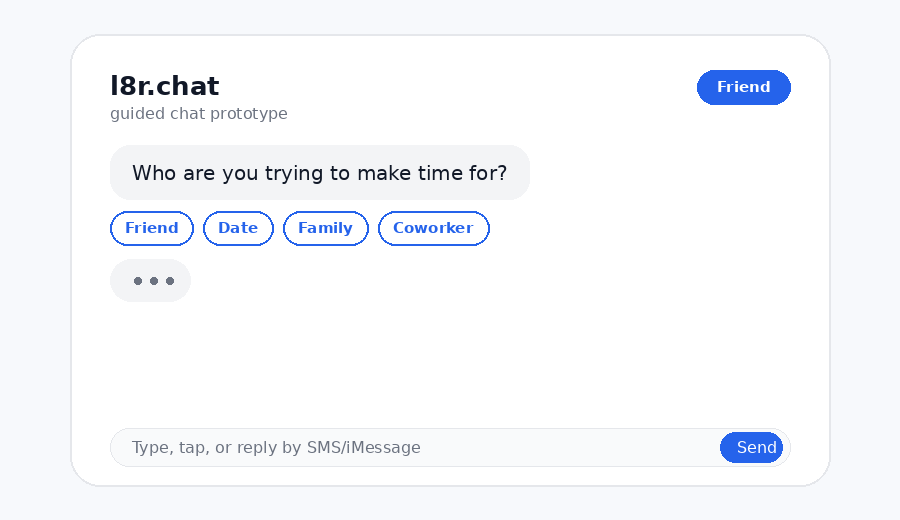
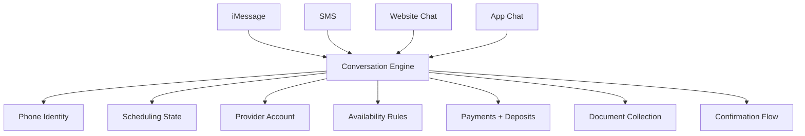
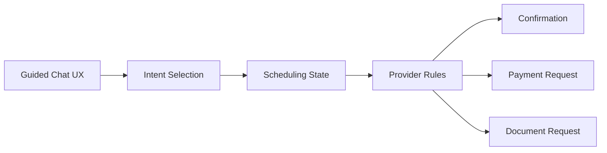

# l8r.chat

> Find free time, fast. See you later.

<p align="center">
  
</p>

[](#status)
[](#product-preview)
[](#identity-model)
[](#channel-model)

**l8r.chat** is a guided chat-first scheduling and booking layer.

It helps people arrange plans, appointments, and services without handling the back-and-forth manually. Consumers use only their phone number. Service providers create accounts to manage availability, services, payments, deposits, fees, and required documents.

## Product Preview

l8r is not a calendar dashboard, form wizard, or marketplace-first booking app.

It is a shared chat experience across:

- iMessage
- SMS
- website chat
- mobile app chat

Every flow uses the same interaction pattern:

```txt
agent message
guided buttons
optional text input
review step
confirmation
```

Users can type, but they should never have to start from a blank prompt.

## Try the Static Preview

Open:

```txt
preview/index.html
```

Or serve locally:

```bash
python3 -m http.server 8000
```

Then visit:

```txt
http://localhost:8000/preview/
```

No framework. No build step. Static HTML/CSS/JavaScript only.

## Core Promise

A person can text or chat with l8r from any supported channel, select what they need from useful buttons or generated reasons, use only their phone number unless they are a provider, and reach a confirmed time while providers can collect deposits, payments, fees, and documents through the same conversational flow.

## Identity Model

| User type | Identity | Account required | UX |
|---|---:|---:|---|
| Consumer | Phone number | No | Guided chat |
| Friend / invitee | Phone number | No | Guided chat |
| Website visitor | Phone number when needed | No | Chat widget |
| App user | Phone number unless provider | No | Same chat |
| Service provider | Email + phone | Yes | Chat-first provider tools |

## Provider Capabilities

Service providers can configure:

- services
- availability rules
- intake questions
- booking confirmations
- deposits
- payments
- cancellation fees
- booking fees
- travel fees
- material fees
- consultation fees
- required documents
- required photos
- waivers
- forms

Consumers do not need l8r accounts to respond, pay, upload, or confirm.

## Guided Chat UX

The UX always shows buttons, suggested actions, generated reasons, or selectable intents.

### Friend flow

```txt
l8r
Who are you trying to make time for?

[Friend] [Date] [Family] [Coworker] [Service provider]

User taps: Friend

l8r
What do you want to make time for?

[Coffee] [Dinner] [Catch up] [Walk] [Call] [Something else]

User taps: Catch up

l8r
Here are a few ways to ask:

[“Want to catch up this week?”]
[“Got time for coffee soon?”]
[“Want to find a time to hang?”]
[Write my own]
```

### Service booking flow

```txt
l8r
What do you need?

[Haircut] [Nails] [Massage] [Tattoo] [Consult] [Repair] [Other]

User taps: Haircut

l8r
What kind of haircut request?

[First available]
[Same barber]
[Specific day]
[Before an event]
[Price check + appointment]
```

### Payment flow

```txt
l8r
Shaz requires a $25 deposit to hold Thursday at 2:30.

[Pay deposit] [Ask a question] [Pick another time]

User taps: Pay deposit

l8r
Secure payment link ready.

[Pay $25] [Cancel]

l8r
Deposit received. Haircut confirmed for Thursday at 2:30.
```

### Document collection flow

```txt
l8r
Shaz needs a reference photo before confirming.

[Upload photo] [Use camera] [Ask why]

User taps: Upload photo

l8r
Photo received. Want to send it to Shaz?

[Send] [Replace] [Cancel]

Provider
Looks good. I can do Thursday at 2:30 with a $25 deposit.

[Send deposit request] [Suggest other time]
```

## Channel Model

l8r should use one conversation engine with multiple channel adapters.



## Product Layers



## MVP Scope

The first preview should prove:

- same guided chat UX across channels
- phone-number identity for non-provider users
- provider-only accounts
- scheduling request generation
- time option selection
- human review before sending
- provider-managed availability rules
- provider payment/deposit collection
- provider document collection
- confirmation flow

## Non-Goals

The prototype should not attempt:

- forced account creation for consumers or friends
- blank-composer-first UX
- full marketplace
- live two-way calendar sync
- escrow
- wallet
- stored balance
- lending
- insurance
- dispute-resolution system
- unrestricted file storage
- permanent document hoarding
- autonomous payment requests without approval
- autonomous sensitive document requests without approval
- HIPAA, SOC 2, PCI, FINRA, or legal-record compliance claims before implementation and verification

## Preview Techniques

This repository previews l8r with common GitHub-friendly techniques:

| Technique | Purpose |
|---|---|
| Badges | Show status, UX model, account model, and channels quickly |
| Animated GIF | Show the guided chat flow directly in the README |
| Static HTML preview | Let reviewers open the prototype without installing anything |
| Mermaid diagrams | Explain architecture without image files |
| Example conversations | Make the product understandable without running code |
| Feature matrix | Separate MVP, later, and non-goal scope |
| Test checklist | Show how the prototype should be verified |

## Suggested Repo Structure

```txt
.
├── README.md
├── AGENTS.md
├── preview/
│   └── index.html
├── assets/
│   └── l8r-prototype-animation.gif
└── docs/
    └── agent-runs/
```

## Preview Checklist

A reviewer should be able to confirm:

- [ ] The domain is `l8r.chat`.
- [ ] The first screen feels like chat, not a landing page.
- [ ] The user sees useful buttons immediately.
- [ ] A consumer can proceed with only a phone number.
- [ ] A provider must create an account.
- [ ] The same flow works conceptually across SMS, iMessage, web, and app.
- [ ] Provider payments and deposits appear inside the chat flow.
- [ ] Provider document requests appear inside the chat flow.
- [ ] Sensitive actions require review or confirmation.
- [ ] Non-goals are explicit.

## Status

Prototype planning stage.

Current package:

```txt
itp-ddb20fcbaf39
```

## License

TBD.
